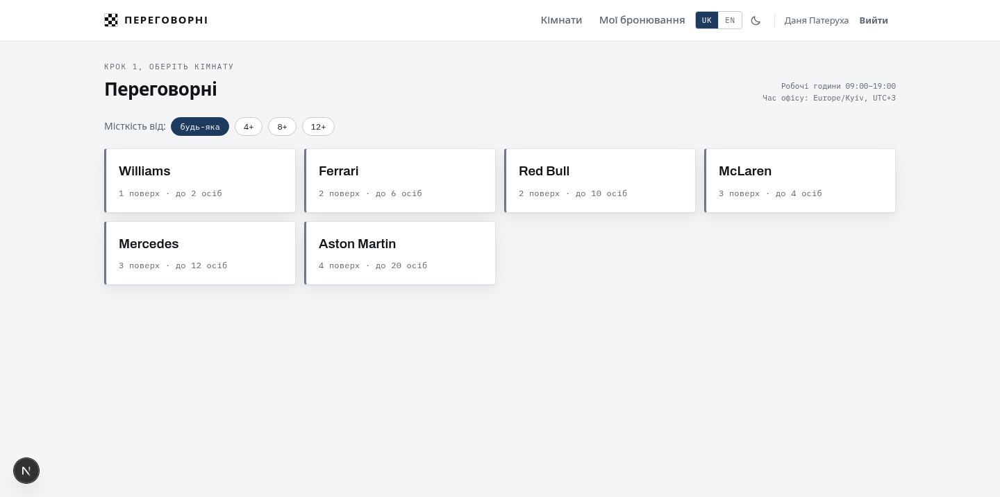
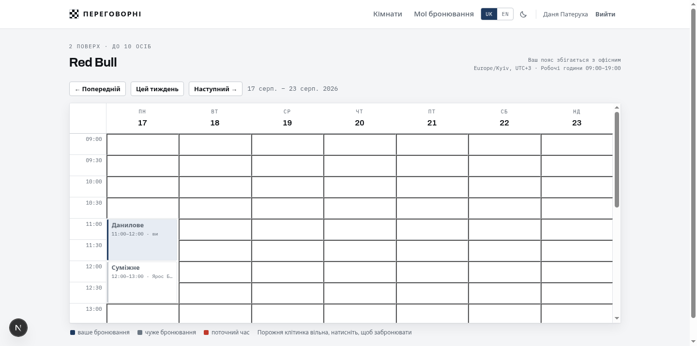
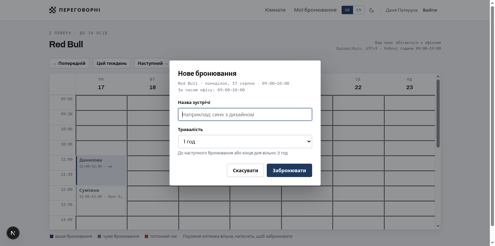
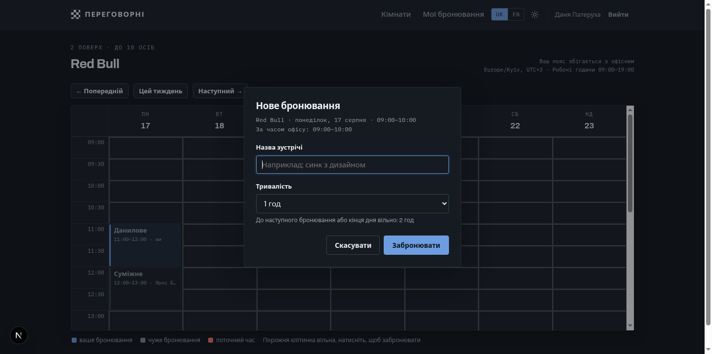
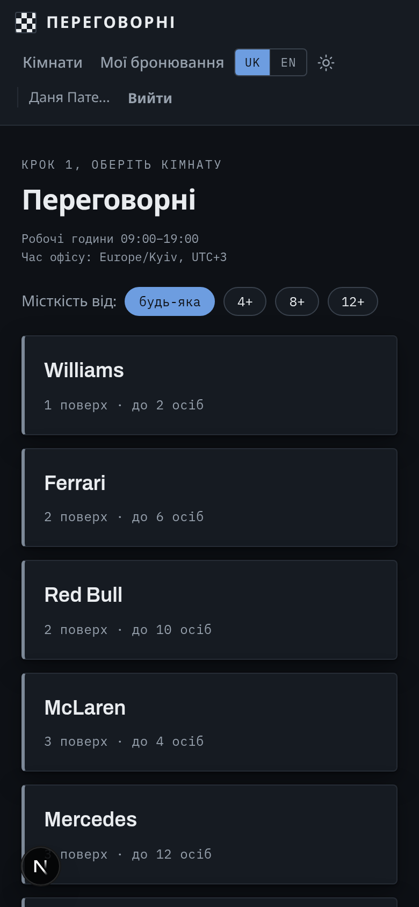

# Meeting rooms

A web app for booking meeting rooms. Weekly room schedule, create and cancel your own bookings, times shown in the user's timezone.

Stack: TypeScript, Next.js 15 with App Router, Prisma 7, SQLite, Vitest.
Frontend and API in a single app. Custom styles — no UI framework, no off-the-shelf calendar component.

## Screenshots

| Room list | Weekly schedule |
|---|---|
|  |  |

| Booking dialog | Dark theme |
|---|---|
|  |  |

| Mobile view |
|---|
|  |

## Getting started

Requires Node.js 20 or later.

```bash
npm install
cp .env.example .env
npm run db:setup
npm run dev
```

The app will be at `http://localhost:3000`.

`npm run db:setup` applies migrations, generates the Prisma client, and seeds the database with demo data.

### Docker

```bash
docker compose up --build
```

Migrations and seeds run on container start. The database lives in a volume, so data survives restarts.

### Seed only

```bash
npm run db:seed
```

The seed is idempotent and safe to re-run. It creates six rooms, two users, and seven demo bookings on the nearest working days.

### Test accounts

| Email                    | Password      |
| ------------------------ | ------------- |
| `danylo@ua-skills.com`   | `password123` |
| `yaroslav@ua-skills.com` | `password123` |

Both accounts have demo bookings, so you can immediately see the difference between your own and others' slots in the grid.

### Tests

```bash
npm test                 # 55 unit + property-based tests
npm run test:integration # 21 integration tests against a real database
```

## How overlap is checked

A booking is a half-open interval — start inclusive, end exclusive. The entire check reduces to one predicate:

```ts
a.start < b.end && b.start < a.end
```

Strict inequalities make back-to-back bookings valid for free. When one booking's end equals another's start, neither condition holds, so there is no overlap. No special case for adjacent slots — it falls out of the interval model naturally.

These functions know nothing about the database or timezones. They take `Date` and return `boolean`, so tests run without starting the app.

In the database the same predicate is expressed in SQL:
`startsAt < candidate.end AND endsAt > candidate.start`. The overlap check and the insert happen inside a single transaction, because a gap between a separate read and write is wide enough for a second request to slip through.

## How time is stored

Both booking boundaries are stored in UTC. The timezone is applied only at two system boundaries: when checking working hours and when displaying to the user.

Working hours are a property of the office, not the user, so they are always checked in `Europe/Kyiv` regardless of where the server runs or where the person sits. Day boundaries are computed with `set({ hour })`, not by adding a duration to midnight. The difference shows up twice a year: `plus({ hours: 9 })` adds nine real hours, so on a DST transition day it yields 10:00 instead of 09:00, shifting the entire office window. Tests for both transition days specify the expected instants directly rather than deriving them with the same formula as the code — otherwise they would reproduce the same bug.

The UI shows times in the browser's timezone. The grid stays office-anchored: columns are office days, rows are twenty 30-minute slots from 09:00 to 19:00 office time. Only the row labels are converted. So a user in Berlin sees the same grid shifted, with a note showing both timezones.

## Race condition protection

Two layers. First, a transaction: the overlap check and the insert run together. Second, a unique index on `roomId` and `startsAt` catches matching start times even if two transactions somehow both read the slot as free. The `P2002` branch returns the same error as the business-logic check, so the user sees one message regardless of which layer fired.

An important limit of the second layer: the index only covers matching start times. Partial overlaps with different starts — say 10:00–12:00 and 10:30–11:30 — are not caught by the index. Only the transactional check handles those.

Verified under load on a production build. Eight concurrent requests for the same slot produced one `201` and seven `409`. Six overlapping requests with different start times, where the index is powerless, produced one `201` and five `409`. In both cases exactly one row ended up in the database. The same scenario is covered by an integration test.

`better-sqlite3` is synchronous, so transactions cannot interleave. Prisma 6 required `connection_limit=1` in the connection string for this; Prisma 7 delegates pool management to the driver, and the parameter is gone.

## Bonus features implemented

- Docker Compose — brings everything up with one command
- Race condition protection described above
- API integration tests
- Room filter by capacity
- Two UI languages — Ukrainian and English
- Light and dark themes
- Mobile layout — the grid shows one day instead of a week on narrow screens
- End-of-booking notification when the next slot in the room is taken
- Email confirmation in dev mode — the link is printed to the server log

Not implemented: recurring bookings.

### Email confirmation

There is no real SMTP, so the confirmation link is printed to the server log, as the spec allows. Before confirming, a user can sign in and browse the schedule but cannot book: creation returns `403` and a banner explains why.

The token is single-use and is cleared on confirmation, so the same link will not work twice. Seed accounts are pre-confirmed.

### End-of-booking notification

The booking author receives a toast `NOTIFY_BEFORE_MINUTES` minutes before their booking ends, but only if the next slot in that room is taken. The default is ten minutes, configurable via env.

A shown notification is marked in the database with `notifiedAt`, so a page refresh will not show it again. Cancelling either of the two bookings deletes the row and the pair simply stops matching — no separate cleanup logic needed. The client polls the server once a minute, which is sufficient for a ten-minute window.

## Structure

```
prisma/
  schema.prisma       User, Room, Booking models
  seed.ts             rooms, test users, demo bookings
src/
  lib/
    interval.ts       interval overlap logic, covered by tests
    booking-rules.ts  booking validation rules
    office.ts         office timezone, working hours
    bookings.ts       create, cancel, queries, race protection
    session.ts        session in an httpOnly cookie
    password.ts       password hashing, email normalisation
    schemas.ts        Zod request schemas
    messages.ts       all UI strings, two locales
    http.ts           unified API error format
  components/
    WeekGrid.tsx      schedule grid built on CSS Grid
    BookingDialog.tsx booking creation
    ConfirmDialog.tsx cancellation confirmation
    MyBookings.tsx    user's own bookings
    RoomsBrowser.tsx  room list
  app/
    api/              API routes
    rooms/, my/, login/, register/
tests/
```

## API

All routes except auth require a session.

| Method   | Path                                       | Purpose                        |
| -------- | ------------------------------------------ | ------------------------------ |
| `POST`   | `/api/auth/register`                       | sign up                        |
| `POST`   | `/api/auth/login`                          | sign in                        |
| `POST`   | `/api/auth/logout`                         | sign out                       |
| `GET`    | `/api/auth/me`                             | current user                   |
| `GET`    | `/api/rooms?minCapacity=`                  | list rooms                     |
| `GET`    | `/api/bookings?roomId=&from=&to=`          | room bookings for a period     |
| `POST`   | `/api/bookings`                            | create booking                 |
| `DELETE` | `/api/bookings/:id`                        | cancel — returns 403 if not yours |
| `GET`    | `/api/bookings/mine?scope=upcoming&page=0` | your bookings                  |

Error format is consistent across all routes:

```json
{ "error": { "code": "SLOT_TAKEN", "message": "This time is already taken." } }
```

Validation errors include a `fields` map so the form can display text next to the right field. The response language is determined by the `Accept-Language` header.

## Design decisions worth noting

- Validation runs on the server, not only in the form. Slot alignment, duration, working hours, past time, overlaps, and cancellation rights are all checked in the API. A direct `curl` request gets the same `422`, `409`, and `403`.
- Sign-in returns the same error for an unknown email and a wrong password. Otherwise the form could be used to check whether a given address is registered.
- Email uniqueness is enforced by the database, not by a pre-insert check. A check would leave a gap between the read and the write.
- Cancellation deletes the row. This keeps the unique index clean — a "cancelled" status would block re-booking the same slot.
- Theme and locale are applied by a script before the first render. Reading them in an effect caused a language flash on every navigation and required pressing the theme toggle twice after a reload.
